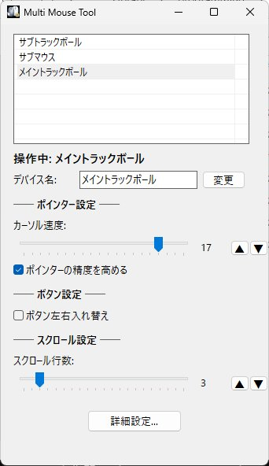

# Multi Mouse Tool

複数マウスのデバイスごとに設定を自動切り替えする Windows デスクトップツールです。  
EitherMouse の代替として Rust で開発しました。



## 概要

マウスを動かすだけで操作中のデバイスを自動検知し、デバイスごとに保存した設定をシステムに即時適用します。複数のマウスを使い分けるユーザー向けです。

## 機能

- デバイスの自動検知・リアルタイム切り替え
- デバイスごとのカーソル速度（1〜20）
- デバイスごとのポインター精度（Enhance Pointer Precision）ON/OFF
- デバイスごとのボタン左右入れ替え（左利き対応）
- デバイスごとのスクロール行数（1〜20）
- デバイス表示名のカスタマイズ
- タスクトレイ常駐
- JSON による設定の永続化

## 動作環境

- Windows 10 / 11
- 管理者権限不要

## インストール

[Releases](../../releases) から `multi-mouse-tool.exe` をダウンロードしてください。

### ソースからビルド

```
git clone https://github.com/ya-ma-n-1972/multi-mouse-tool.git
cd multi-mouse-tool
cargo build --release
```

## 使い方

1. アプリを起動 → 接続中のマウスが自動で一覧表示されます
2. マウスを動かす → 操作中のデバイスがハイライトされ、設定パネルに反映されます
3. 設定を変更 → システムに即時適用され、自動保存されます
4. ウィンドウを閉じる → タスクトレイに常駐します

「詳細設定...」からデバイスの監視対象/監視外を切り替えできます（プログラマブルキーボード等の除外用）。

## 既知の制限事項

- Windows のマウス設定はシステム全体に適用されます。本ツールはデバイス切り替え時に設定を変更する方式のため、2つのマウスを同時操作した場合は最後に動かしたデバイスの設定が適用されます
- マウスモードを持つプログラマブルキーボードがデバイス一覧に表示される場合があります。「監視外」機能で非表示にできます

## ライセンス

未定

## 作者

ヤーマン